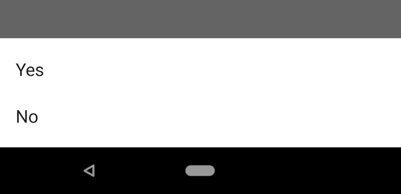

[](https://jitpack.io/#allco/BottomSheetLib)

# BottomSheetLib
A tiny library which helps to use a BottomSheet defined by Material Design.

## How to use
### Include
TBD


## Examples
The following reproduces some Examples [provided by Google](https://material.io/guidelines/components/bottom-sheets.html#bottom-sheets-specs).  

### #1
 

```
private fun runExample1() {
        bottomSheet {
            clickableItem {
                title = "Share"
                iconRes = R.drawable.ic_share_black
                onClicked = { toast(title.toString()) }
            }
            clickableItem {
                title = "Upload"
                iconRes = R.drawable.ic_cloud_upload_black
                onClicked = { toast(title.toString()) }
            }
            clickableItem {
                title = "Copy"
                iconRes = R.drawable.ic_content_copy_black
                onClicked = { toast(title.toString()) }
            }
            clickableItem {
                title = "Print this page"
                iconRes = R.drawable.ic_print_black
                onClicked = { toast(title.toString()) }
            }
        }.show()
    }
```
