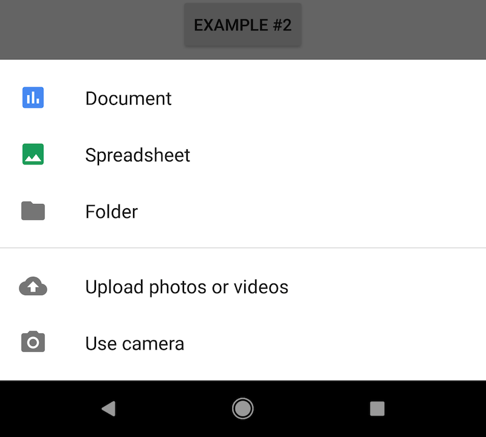

[](https://jitpack.io/#allco/BottomSheetLib)

# BottomSheetLib
A tiny library which helps to use a BottomSheet defined by Material Design.   

## Motivation
There is an authentic implementation [provided by Goolge](https://materialdoc.com/components/bottom-sheets/) 
which is inarguably useful but it requires a lot of boiler plate code even if its only needed to show something trivial (like yes/no buttons).  

This library is supposed to simplify the creation of general purpose modal BottomSheets by providing configuration DSL based on Kotlin-extensions. 

## Requirements
*DataBinding should be enabled*
 Add it in your module's build.gradle:

		dataBinding {enabled = true}

## Include
Step 1. Add it in your root build.gradle at the end of repositories:

	allprojects {
		repositories {
			...
			maven { url 'https://jitpack.io' }
		}
	}
	
Step 2. Add the dependency

	dependencies {
	        compile 'com.github.allco:BottomSheetLib:v1.0'
	}

## Examples
The following examples was inspired by [Google's definition of BottomSheet](https://material.io/guidelines/components/bottom-sheets.html#bottom-sheets-specs).  

### #1
 

```kotlin
    fun runExample1(view: View) {
        bottomSheet {
            clickableItem {
                title = "Share"
                iconRes = R.drawable.ic_share_black
                onClicked = { toast(title.toString()) }
            }
            clickableItem {
                title = "Upload"
                iconRes = R.drawable.ic_cloud_upload_black
                onClicked = { toast(title.toString()) }
            }
            clickableItem {
                title = "Copy"
                iconRes = R.drawable.ic_content_copy_black
                onClicked = { toast(title.toString()) }
            }
            clickableItem {
                title = "Print this page"
                iconRes = R.drawable.ic_print_black
                onClicked = { toast(title.toString()) }
            }
        }.show()
    }
```

### #2


```kotlin
    fun runExample2(view: View) {
        bottomSheet {
            clickableItem {
                title = "Document"
                iconResTintColor = R.color.icon_document
                iconRes = R.drawable.ic_insert_chart_black
                onClicked = { toast(title.toString()) }
            }
            clickableItem {
                title = "Spreadsheet"
                iconResTintColor = R.color.icon_spreadsheet
                iconRes = R.drawable.ic_insert_photo
                onClicked = { toast(title.toString()) }
            }
            clickableItem {
                title = "Folder"
                iconRes = R.drawable.ic_folder_black
                onClicked = { toast(title.toString()) }
            }

            divider { }

            clickableItem {
                title = "Upload photos or videos"
                iconRes = R.drawable.ic_cloud_upload_black
                onClicked = { toast(title.toString()) }
            }

            clickableItem {
                title = "Use camera"
                iconRes = R.drawable.ic_photo_camera_black
                onClicked = { toast(title.toString()) }
            }
        }.show()
    }

``` 

### #3
Custom items



```kotlin
    fun runExample3(view: View) {
        bottomSheet {
            maxInitialHeightInPercents = 100
            onCanceled = { toast("Bottomsheet was canceled") }

            title { title = "Custom items" }

            divider { // shortened divider
                leftOffset = resources.getDimensionPixelOffset(R.dimen.dividerLeftOffset)
                rightOffset = resources.getDimensionPixelOffset(R.dimen.dividerRightOffset)
            }

            clickableItem {
                title = "Item with `Drawable` as icon."
                iconDrawable = ResourcesCompat.getDrawable(resources, R.drawable.photo_icon, null)
            }
            
            divider {} // full-length divider

            custom {
                layoutRes = R.layout.custom_layout
                onBind = { binding, position, dialogInterface ->
                    (binding as CustomLayoutBinding).apply {
                       binding.model = ... // setup data accordingly `position`
                    }
                }
            }
        }.show()
    }
```
